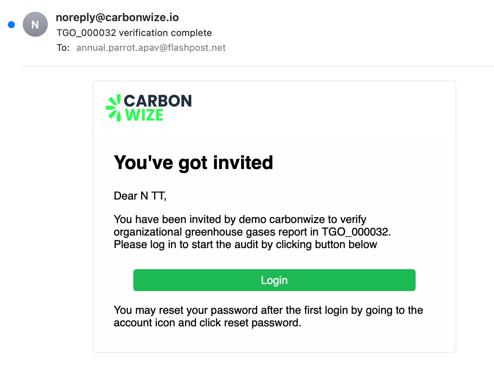

# ✅ Audit completed

<figure><figcaption></figcaption></figure>

* When the review is complete, the review item will be displayed on the Completed page and the status will change to Completed.

<figure><figcaption></figcaption></figure>

* When you click to view report, the audit data is displayed, and the report can be downloaded. The data cannot be edited.

<figure><figcaption></figcaption></figure>

* When you click Edit Attachment, it will show the uploaded verification completion document.
  * Verification Certificate
  * Greenhouse Gas Emission Report
  * Other Documents
* You can edit by adding more files or deleting old files and attaching new ones.
* When the verification completion document is successfully edited, the organization administrator will receive an email notification to update the verification completion document edit.
