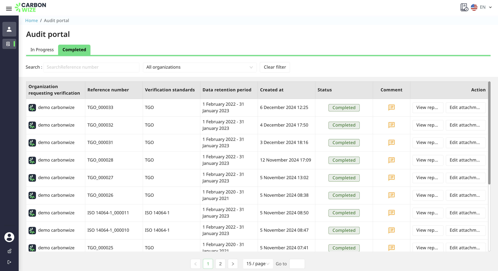

# 🗃️ Audit

<figure><figcaption></figcaption></figure>

* When an organization submits a review, the auditor will receive a You've got invited notification email to inform the auditor that the organization has submitted the review.

<figure><figcaption></figcaption></figure>

* When the organization submits the review, the review status will be displayed as Waiting for the verifier.
* Describe the review status further.
  * Draft Can view report Edit audit settings Edit data Delete audit
  * Waiting for auditor Can view report only
  * In progress Can view report only
  * Revising Can view report Edit audit settings Edit data
  * Audit completed Can view report View attachment only
* The review data page on the reviewer side shows the review data, including the organization requesting the review, document number, review standard, data retention period, created when, status.
* The reviewer cannot edit the review data.

1. Click the Start Review button to enter the review process.

<figure><figcaption></figcaption></figure>

1. When entering the review phase, the status will change to In Progress.

### Greenhouse gas emissions information

<figure><figcaption></figcaption></figure>

* Shows a table of standard proportions used as a reference for reporting greenhouse gases, comparing the scope and proportions expressed in tCO2e.

### Organization Information/Scope

<figure><figcaption></figcaption></figure>

* Displays all organization scope information such as organization scope, organization structure, organization chart, production process chart.

### Organization Information/All activities of the organization 

<figure><figcaption></figcaption></figure>

* Show all activities of the organization by branch
* Show the scope of operations

### Organization Information/Data quality management 

<figure><figcaption></figcaption></figure>

* Show data quality management Activity name, document and evidence type, data collector and recorder, data reviewer and approver
* Show the structure of data quality management system

### Organization Information/Carbon absorption / Carbon reduction 

<figure><figcaption></figcaption></figure>

* Displays carbon sequestration records, greenhouse gas reduction projects/renewable energy certifications (data can be added by pressing the add data button)

### Organization Information/Calibration Record 

<figure><figcaption></figcaption></figure>

* Displays the standard calibration records of the equipment/measuring tool (data can be added by pressing the Add Record button)

### Measure list 

<figure><figcaption></figcaption></figure>

* Displays activity list data according to the standard reference for reporting greenhouse gases.
* You can click on the list to see more details.

<figure><figcaption></figcaption></figure>

When clicking to view more details of the activity data list, it shows comparative data for the base year FY (tCo2eq), fiscal year FY (tCo2eq), and monthly attachments.

<figure><figcaption></figcaption></figure>

* Displays the calculation data of the quantity and the Emission factors that have been mapped.
* You can click on the list to see more details.

<figure><figcaption></figcaption></figure>

* When you click to see more details, it shows calculation information: Amount, Unit, Total (kg GHG/unit), Total GHG (TonCO2e).

### Significant

<figure><figcaption></figcaption></figure>

* Displays the significance of data as a percentage (%) of each standard used as a reference in reporting greenhouse gases.

### Measurement Uncertainty 

<figure><figcaption></figcaption></figure>

* Show the uncertainty assessment of the activity list
* You can click to view the assessment criteria.

<figure><figcaption></figcaption></figure>

* Evaluation criteria for scoring of activity items

### Correction Report 

<figure><figcaption></figcaption></figure>

* The correction report section is for reviewers only.
* If organization has an issue that needs to be resolved, you can add a correction report to this page.

#### Add correction report

1. Press the New button.
2. Enter the issue.
3. Select the related regulations.
4. You can delete the correction report.

<figure><figcaption></figcaption></figure>

* Once the organization has successfully resolved the Correction report, the status will change to Wait to check again

<figure><figcaption></figcaption></figure>

1. When the auditor has completed the report correction, the report status will change to Done

<figure><figcaption></figcaption></figure>

1. Enter the reviewer's conclusion

### Verification completed

<figure><figcaption></figcaption></figure>

1. When the review has no correction reports, press the Verification completed button.
2. Upload Verification Completion Document
   1. Verification Certificate
   2. Greenhouse Gas Emission Report
   3. Other Documents
3. Press the next button

<figure><figcaption></figcaption></figure>

1. Press the OK button to confirm the verification is complete.

<figure><figcaption></figcaption></figure>

* Review completed The system sends an email notification of review completion to the organization's administrator.
