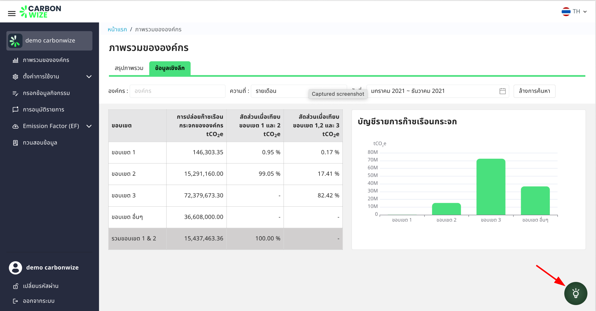

# 🗓️ ตั้งค่าปีงบประมาณ

### ปีงบประมาณ

<figure><figcaption></figcaption></figure>

* แสดงวันที่เริ่มปีงบประมาณ, วันที่สิ้นสุดปีงบประมาณ

### แก้ไขปีงบประมาณ

<figure><figcaption></figcaption></figure>

1. กดที่วันที่เริ่มปีงบประมาณ

<figure><figcaption></figcaption></figure>

1. เลือกวันที่เริ่มปีงบประมาณ
2. กดปุ่มบันทึก

<figure><figcaption></figcaption></figure>

1. กดปุ่มตกลงเพื่อเปลี่ยนแปลงปีงบประมาณ

* การเปลี่ยนแปลงปีงบประมาณ อาจส่งผลต่อข้อมูลการรายงาน
